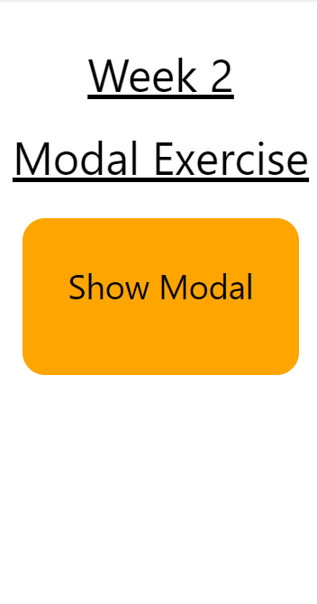
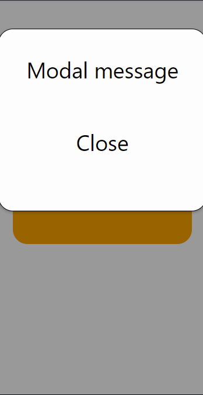

# Mobile and hybrid technologies - Task week 2

Task: If user presses the text, a modal screen opens with following content. User can close
the modal by pressing Close, or on Android by using hardware back button.
  
Images from Web emulator. Looks better on iPhone tho!
  
 